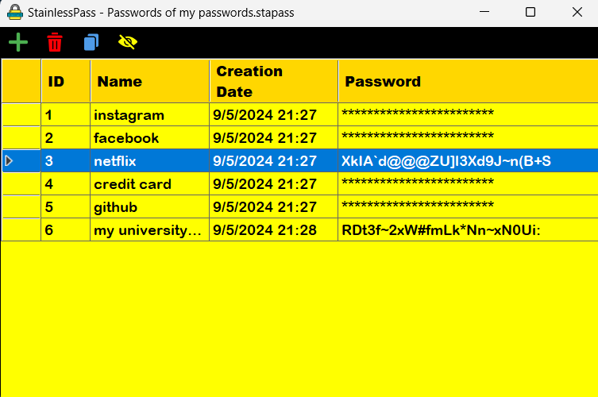
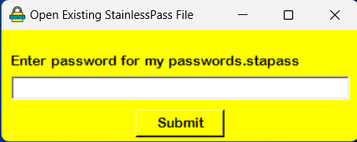
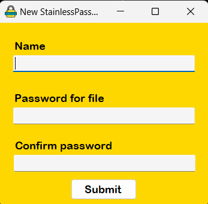
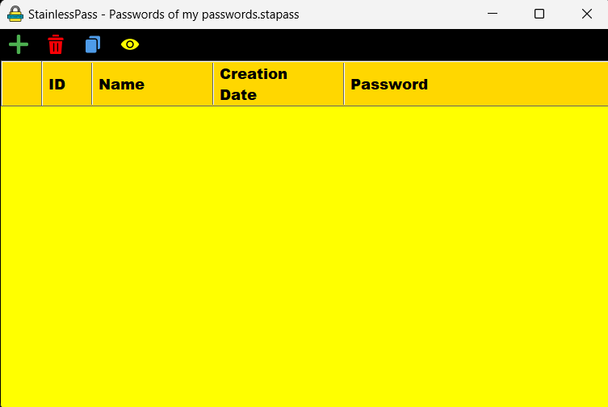

# StainlessPass

StainlessPass is an open source and simple password manager. It creates strong password for you, and stores your encrypted created passwords to a file with extension .stapass .

It encrypts your stored passwords with AES algorithm. You specify a password to open .stapass extension.

## SETUP

Build the project file and execute or just download the standalone(for windows x86) StainlessPass.exe file and execute it.

## USAGE

Open the executable file or build. 

If you don't have a StainlessPass file, create it with 'New  StainlessPass File' button.

If you have, click 'Open Existing File' button and choose your file with .stapass extension. After that you must enter a password for this file.

It takes a name for password file and password for this file. Password should be minimum 8 length. Click Submit.

The password manager screen will be opened. 

If you want to add a password, click the green '+' button. You should enter the name for this password(for example instagram). It creates your password and stores to file.

If you want to remove a password, click the password and click the trash icon.

If you want to copy a password, click the password and click the copy icon.

If you want to see the created password, click the eye icon.